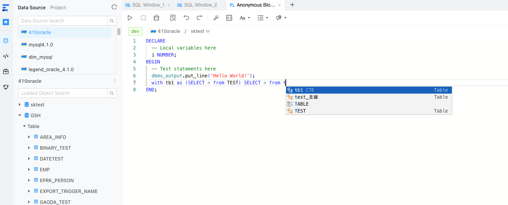

# ODC-Parser-JS

ODC-Parser-JS provides a JavaScript version of SQL Parser along with a ready-to-use Monaco Plugin. It currently supports OceanBase MySQL and OceanBase Oracle SQL dialect. 

## Features

- SQL Parser: ODC-Parser-JS provides a JavaScript-based SQL Parser that can parse SQL queries for OceanBase MySQL and OceanBase Oracle databases.
- Monaco Plugin: It includes a Monaco Plugin that can seamlessly integrate with the Monaco Editor, allowing you to enhance your SQL editing experience.

## Installation

### Monaco Plugin

You can install using npm:

```bash
npm install @oceanbase-odc/monaco-plugin-ob
```

## Usage

### Monaco Plugin

To use the Monaco Plugin, import it in your JavaScript code and initialize it with the Monaco Editor:

```javascript
import Plugin from '@oceanbase-odc/monaco-plugin-ob';
const OBPlugin = new Plugin();
OBPlugin.setup();

monaco.editor.create(domRef.current, {
      value,
      language: language, // 'obmysql' | 'oboracle'
      theme: themeValue, // 'obwhite'
    });
```
Make sure you have the Monaco Editor library included in your project.

## Contributing

Contributions are welcome! If you find any issues or have suggestions for improvements, please open an issue or submit a pull request on the GitHub repository.

## License

ODC-Parser-JS is licensed under the [MIT License](https://github.com/oceanbase/odc-parser-js/blob/main/LICENSE).